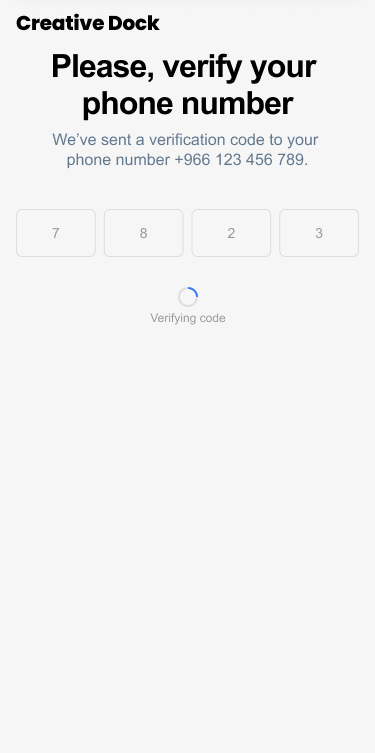

# Bootcamp

Creative Dock bootcamp task - React Native

## Task: Creative Dock Registration

Implement a simple mobile app with 3 screens following the provided designs (link to Figma provided below).

This is the first and second screen of the registration funnel, where the user needs to provide information required for creation of an account in the app and then validate the by unique code. For purpose of this bootcamp please consider any pin code as valid.


### Screen 1 - User registration form


1. For the purpose of this bootcamp, you can code the full screen with all the following fields:

 ```
 - National ID number (text field)
 - First Name (text field)
 - Last Name (text field)
 - Phone number (text field)
 - Password (text field)
 - I accept terms and conditions and privacy policy (checkbox) * links don't need to lead anywhere
 ```

2. Pressing **Create an account**, should validate the fields and if valid user is sent to another screen, otherwise error message should be displayed (not a priority).


### Screen 2 - Code verification


User has the option to fill in the code by hand (digit by digit).

When all fields are filled, the state changes according to this image:



### Screen 3 - Success screen


### Links

- Figma https://www.figma.com/file/lxxOd1sJKkyZqYClkWjwfQ/Bootcamp?node-id=0%3A1
